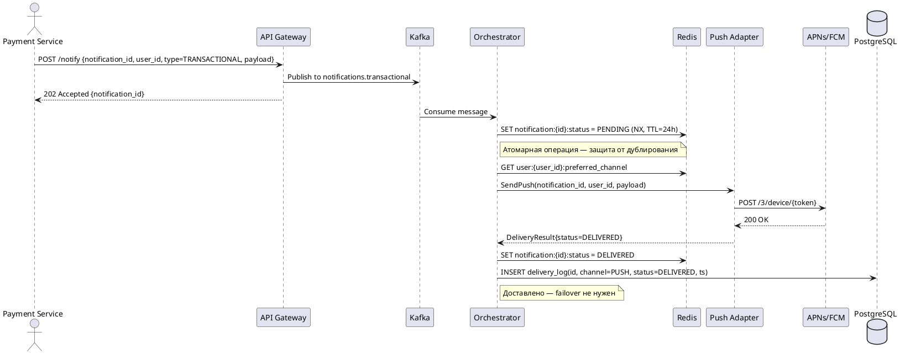
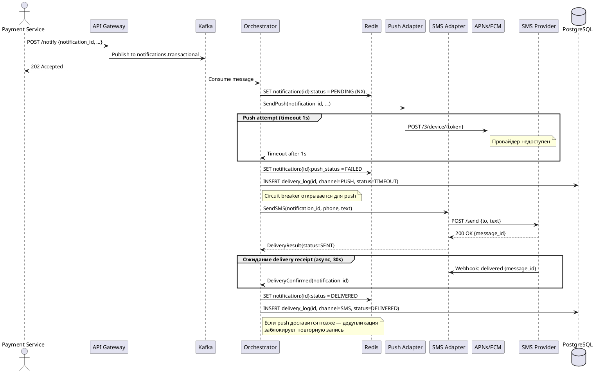
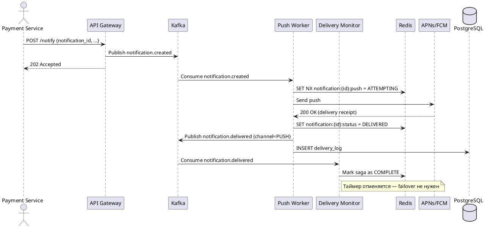
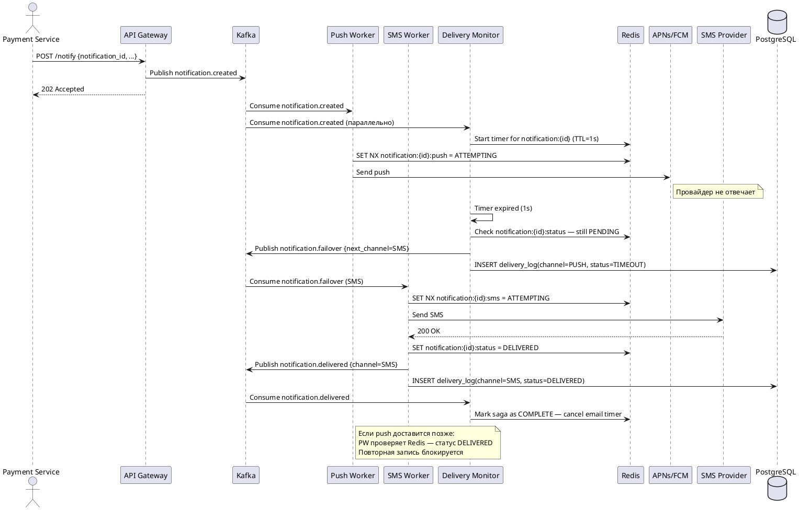

# Домашнее задание №4 — Централизованная платформа уведомлений

---

## 1. Функциональные требования

| № | Требование |
|---|------------|
| FR1 | Система принимает запросы на отправку уведомлений от любого внутреннего сервиса банка через единый API и доставляет их пользователю по одному или нескольким каналам (push, SMS, email). |
| FR2 | Система поддерживает три типа уведомлений: транзакционные (критичные), сервисные и маркетинговые — с различными приоритетами обработки. |
| FR3 | Пользователь может управлять предпочтениями: отключать сервисные и маркетинговые уведомления по каналам. Транзакционные уведомления отключить нельзя. |
| FR4 | Система автоматически переключается на резервный канал доставки, если основной канал недоступен или не подтвердил доставку в течение заданного времени (failover). |
| FR5 | Система предотвращает дублирование уведомлений: одно и то же уведомление не доставляется пользователю более одного раза. |
| FR6 | Система поддерживает массовую рассылку маркетинговых уведомлений на аудиторию до 1 млн пользователей с возможностью планирования времени отправки. |
| FR7 | Система предоставляет статус доставки каждого уведомления (отправлено, доставлено, не доставлено) для внутренних сервисов и аналитики. |

---

## 2. Нефункциональные требования

| № | Обозначение | Требование |
|---|-------------|------------|
| 1 | NFR1 | **Задержка:** транзакционные уведомления отправляются в канал доставки не позднее 3 с с момента получения запроса (p99 ≤ 3 с). |
| 2 | NFR2 | **Пропускная способность:** система обрабатывает не менее 50 000 уведомлений/с в пиковой нагрузке. |
| 3 | NFR3 | **Доступность:** SLA платформы — 99,95%. Для подсистемы транзакционных уведомлений — 99,99%. |
| 4 | NFR4 | **Надёжность доставки:** гарантированная доставка транзакционных уведомлений хотя бы через один канал — не менее 99,9%. |
| 5 | NFR5 | **Масштабируемость:** горизонтальное масштабирование без изменения архитектуры при росте DAU с 3 млн до 30 млн. |
| 6 | NFR6 | **Наблюдаемость:** каждое уведомление имеет сквозной trace_id; метрики (latency, delivery rate, error rate) экспортируются в реальном времени. |
| 7 | NFR7 | **Изоляция нагрузки:** маркетинговые рассылки не влияют на задержку транзакционных уведомлений. |

---

## 3. Архитектурно значимые требования (ASR)

### ASR-1: Низкая задержка транзакционных уведомлений

**Связанные требования:** FR2, FR4, NFR1, NFR3

**Почему влияет на архитектуру:**
Требование p99 ≤ 3 с (включая возможный failover) исключает синхронные цепочки вызовов. Необходима выделенная очередь с высоким приоритетом, минимальное число промежуточных шагов и предустановленные соединения с провайдерами. Failover должен занимать не более 1–2 с, что требует хранения состояния попыток в быстром in-memory хранилище.

### ASR-2: Изоляция нагрузки между типами уведомлений

**Связанные требования:** FR2, FR6, NFR2, NFR7

**Почему влияет на архитектуру:**
Маркетинговая кампания на 1 млн пользователей создаёт всплески нагрузки, которые без изоляции «затопят» очередь и нарушат SLA транзакционных уведомлений. Требуются разделённые очереди по типам уведомлений с отдельными пулами воркеров и rate limiting для маркетинговых.

### ASR-3: Гарантированная доставка с дедупликацией

**Связанные требования:** FR4, FR5, NFR4, NFR6

**Почему влияет на архитектуру:**
At-least-once семантика (необходимая для гарантии доставки) по природе создаёт дубликаты при retry и failover. Нужен идемпотентный ключ (notification_id) и хранилище состояний с атомарными операциями check-and-set. Архитектура должна явно разделять «отправку в канал» и «подтверждение доставки».

---

## 4. Ключевые архитектурные вопросы

### Вопрос 1: Как организовать failover между каналами без дублирования?

**Порождается:** ASR-1, ASR-3, FR4, FR5

**Почему важен:**
Если push «завис» и мы переключились на SMS, а push всё же доставился — пользователь получит два уведомления. Нужно решить: ждать явного подтверждения недоставки или использовать таймаут? Как хранить состояние попыток? Ответ определяет выбор хранилища состояний и протокол взаимодействия с провайдерами.

### Вопрос 2: Как обеспечить изоляцию нагрузки при единой точке входа?

**Порождается:** ASR-2, NFR2, NFR7, FR6

**Почему важен:**
Единый API упрощает интеграцию, но создаёт риск «шумного соседа». Нужно решить: разделять очереди на уровне брокера (разные топики) или приложения (приоритетные очереди)? Как ограничить скорость маркетинговых рассылок? Это влияет на выбор брокера и топологию деплоя воркеров.

### Вопрос 3: Как управлять нестабильностью внешних провайдеров?

**Порождается:** ASR-1, ASR-3, NFR3, NFR4

**Почему важен:**
Внешние SMS/email провайдеры могут быть недоступны минутами или часами. Нужно решить: использовать ли circuit breaker для быстрого переключения? Сколько провайдеров держать для каждого канала? Как отличить «провайдер недоступен» от «уведомление не доставлено»?

---

## 5. Архитектурные последствия ASR

### ASR-1: Низкая задержка

| Последствие | Описание |
|-------------|----------|
| Выделенная очередь высокого приоритета | Отдельный топик Kafka для транзакционных уведомлений с выделенными воркерами |
| In-memory хранилище состояний | Redis для хранения статуса попыток доставки |
| Предустановленные соединения | Connection pool к push/SMS/email провайдерам, без cold start |
| Таймаут-based failover | Переключение по таймауту (1 с для push), не ждать явного отказа |
| Асинхронная обработка | API принимает запрос синхронно (возвращает notification_id), обработка — асинхронно |

### ASR-2: Изоляция нагрузки

| Последствие | Описание |
|-------------|----------|
| Разделённые топики | `notifications.transactional`, `notifications.service`, `notifications.marketing` |
| Отдельные пулы воркеров | Независимые consumer groups для каждого типа уведомлений |
| Rate limiting | Token bucket на уровне маркетингового воркера |
| Throttling кампаний | Маркетинговые кампании разбиваются на батчи с контролируемой скоростью |
| Квоты ресурсов | CPU/memory limits для воркеров разных типов в Kubernetes |

### ASR-3: Гарантированная доставка с дедупликацией

| Последствие | Описание |
|-------------|----------|
| Идемпотентный ключ | Каждое уведомление имеет уникальный `notification_id` (UUID v4) |
| Хранилище состояний | Redis с TTL: `pending → sent → delivered / failed` |
| Атомарная операция | Перед отправкой — атомарная проверка check-and-set |
| Персистентный журнал | PostgreSQL для долгосрочного хранения истории доставки |
| Retry с backoff | Повторные попытки с exponential backoff и максимальным числом попыток |

---

## 6. Архитектурные решения, которые НЕ подходят

### Решение 1: Синхронная цепочка вызовов

**Описание:** Notification Platform синхронно вызывает провайдера и ждёт ответа перед возвратом результата вызывающему сервису.

**Нарушаемый ASR:** ASR-1, ASR-2

**Почему не подходит:**
Задержка ответа SMS-провайдера (до 5–10 с) нарушает NFR1 (p99 ≤ 3 с). При failover суммарное время ожидания (push timeout + SMS timeout) легко превышает 3 с. При пиковой нагрузке синхронная модель требует огромного числа потоков. Медленные маркетинговые рассылки блокируют потоки для транзакционных уведомлений.

### Решение 2: Единая очередь для всех типов уведомлений

**Описание:** Все уведомления помещаются в одну общую очередь и обрабатываются единым пулом воркеров в порядке FIFO.

**Нарушаемый ASR:** ASR-2, ASR-1

**Почему не подходит:**
Маркетинговая кампания на 1 млн пользователей «затопит» очередь, транзакционные уведомления будут ждать — прямое нарушение NFR1 и NFR7. Даже с приоритетной очередью при высоком потоке маркетинговых сообщений транзакционные могут «голодать» (starvation). Невозможно независимо масштабировать обработку разных типов.

---

## 7. Неопределённости и архитектурные риски

### Неопределённость 1: Реальная надёжность push-провайдеров

**Что неизвестно:**
Каков реальный процент недоставленных push-уведомлений? APNs и FCM не гарантируют доставку: устройство может быть офлайн, токен — устаревшим. Неизвестно, насколько часто будет срабатывать failover на SMS, что влияет на стоимость.

**Как проверить:**
Провести пилот: отправлять транзакционные уведомления через push с отслеживанием delivery receipt в течение 1–2 месяцев. Собрать метрики: процент доставленных push, среднее время доставки, частота таймаутов. На основе данных откалибровать таймаут failover.

### Неопределённость 2: Поведение при одновременном пике транзакционного трафика и массовой кампании

**Что неизвестно:**
Насколько эффективно изоляция очередей защитит транзакционные уведомления при одновременном старте маркетинговой кампании на 1 млн пользователей и пике транзакционного трафика (зарплатные выплаты)?

**Как проверить:**
Провести нагрузочное тестирование: одновременно запустить маркетинговую кампанию (1 млн сообщений) и поток транзакционных уведомлений (пиковый RPS). Измерить p99 задержки транзакционных. Если p99 > 3 с — увеличить изоляцию или снизить скорость маркетинговых рассылок.

---

---

# RFC: Механизм гарантированной доставки критичных уведомлений с кросс-канальным failover

| Метаданные | Значение |
|------------|----------|
| **Статус** | DESIGN |
| **Автор(ы)** | Блохтин Н. |
| **Ответственный** | Блохтин Н. |
| **Бизнес-заказчик** | Команда Notification Platform |
| **Дата создания** | 2026-04-07 |
| **Дата обновления** | 2026-04-07 |

---

## Оглавление

1. [Контекст](#контекст)
2. [Пользовательские сценарии](#пользовательские-сценарии)
3. [Статистика и расчёт нагрузки](#статистика-и-расчёт-нагрузки)
4. [Требования](#требования-rfc)
5. [Варианты решения](#варианты-решения)
6. [Сравнительный анализ](#сравнительный-анализ)
7. [Выводы](#выводы)
8. [Приложения](#приложения)

---

## Контекст

Онлайн-банк обрабатывает транзакции пользователей (переводы, списания, пополнения). Каждая транзакция должна сопровождаться уведомлением — это требование безопасности и пользовательского опыта. Сейчас уведомления отправляются каждым сервисом самостоятельно: задержки, дублирование, отсутствие гарантий доставки.

Необходимо спроектировать подсистему гарантированной доставки критичных (транзакционных) уведомлений в рамках централизованной Notification Platform:
- Гарантировать доставку хотя бы через один канал (push → SMS → email)
- Автоматически переключаться на резервный канал при отказе основного
- Предотвращать дублирование при failover
- Минимизировать стоимость (приоритет push как самого дешёвого канала)
- Обеспечивать наблюдаемость каждой попытки доставки

---

## Пользовательские сценарии

| Приоритет | Тип сценария | Действующее лицо | Сценарий |
|-----------|--------------|------------------|----------|
| MUST HAVE | Happy path | Пользователь | Совершает перевод → получает push-уведомление в течение 3 с |
| MUST HAVE | Failover | Пользователь | Push-провайдер недоступен → получает SMS в течение 5 с |
| MUST HAVE | Failover | Пользователь | Push и SMS недоступны → получает email в течение 30 с |
| MUST HAVE | Дедупликация | Пользователь | Push доставлен с задержкой после отправки SMS → получает только одно уведомление |
| MUST HAVE | Настройки | Пользователь | Не может отключить транзакционные уведомления (только выбрать предпочтительный канал) |
| SHOULD HAVE | Наблюдаемость | Оператор | Видит в дашборде статус каждого уведомления и историю попыток доставки |
| SHOULD HAVE | Аудит | Служба безопасности | Может получить подтверждение доставки уведомления о транзакции |
| COULD HAVE | Предпочтения | Пользователь | Выбирает предпочтительный канал для транзакционных уведомлений |

---

## Статистика и расчёт нагрузки

```
MAU: 10 млн, DAU: 3 млн, Peak Concurrent: 300 000

Транзакционных в день: 3 000 000 × 2 = 6 000 000 уведомлений/день

80% транзакций в 8-часовое активное окно (28 800 с):
Средний RPS (транзакционные): 4 800 000 / 28 800 ≈ 167 уведомлений/с
Пиковый коэффициент ×10 (зарплатные дни):
Пиковый RPS (транзакционные): ≈ 1 700 уведомлений/с

Маркетинговая кампания (1 млн за 1 час):
1 000 000 / 3 600 ≈ 278 уведомлений/с

Пиковый RPS (все типы): 1 700 + 278 + 500 ≈ 2 500 уведомлений/с
С учётом retry/failover (×3): ~7 500 запросов/с к провайдерам

Redis (активные записи, TTL 24ч):
6 000 000 × 200 байт × 3 попытки ≈ 3.6 ГБ

PostgreSQL (история 90 дней):
6 000 000 × 90 × 300 байт ≈ 162 ГБ
```

---

## Требования RFC

### Функциональные требования

| № | Приоритет | Обозначение | Требование |
|---|-----------|-------------|------------|
| 1 | MUST HAVE | FR1 | Система принимает запрос и гарантирует доставку хотя бы через один канал |
| 2 | MUST HAVE | FR2 | При недоступности основного канала — автоматический failover: push → SMS → email |
| 3 | MUST HAVE | FR3 | Если уведомление доставлено через один канал, попытки через другие прекращаются |
| 4 | MUST HAVE | FR4 | Транзакционные уведомления нельзя отключить; пользователь выбирает предпочтительный канал |
| 5 | MUST HAVE | FR5 | Каждая попытка доставки логируется с результатом и доступна для аудита |
| 6 | SHOULD HAVE | FR6 | Поддержка нескольких провайдеров для каждого канала с автоматическим переключением |
| 7 | COULD HAVE | FR7 | Пользователь настраивает предпочтительный канал для транзакционных уведомлений |

### Нефункциональные требования

| № | Приоритет | Обозначение | Требование |
|---|-----------|-------------|------------|
| 1 | MUST HAVE | NFR1 | Задержка через основной канал: p99 ≤ 3 с |
| 2 | MUST HAVE | NFR2 | Задержка при failover на SMS: p99 ≤ 5 с |
| 3 | MUST HAVE | NFR3 | Доступность подсистемы: 99,99% |
| 4 | MUST HAVE | NFR4 | Гарантия доставки: ≥ 99,9% транзакционных уведомлений |
| 5 | MUST HAVE | NFR5 | Пропускная способность: ≥ 2 000 транзакционных уведомлений/с |
| 6 | MUST HAVE | NFR6 | Дедупликация: вероятность дублирования ≤ 0,01% |
| 7 | MUST HAVE | NFR7 | Наблюдаемость: trace_id, метрики в реальном времени |
| 8 | SHOULD HAVE | NFR8 | Минимизация использования SMS (только при недоступности push) |

---

## Варианты решения

---

### Вариант 1: Stateful Delivery Orchestrator

> **Описание:** Выделенный сервис-оркестратор управляет жизненным циклом каждого транзакционного уведомления. Состояние хранится в Redis. Оркестратор последовательно пробует каналы, отслеживает таймауты и останавливается при первой успешной доставке.

#### Архитектура (C4 Container)

```plantuml
@startuml C4_Container_Variant1
!include https://raw.githubusercontent.com/plantuml-stdlib/C4-PlantUML/master/C4_Container.puml

LAYOUT_WITH_LEGEND()

Person(user, "Пользователь", "Клиент банка")

System_Boundary(bank, "Банковские системы") {
    Container(payment_svc, "Payment Service", "Java/Go", "Инициирует транзакции")
}

System_Boundary(np, "Notification Platform") {
    Container(api_gw, "Notification API Gateway", "Go/gRPC", "Единая точка входа, валидация")
    Container(kafka, "Message Broker", "Apache Kafka", "Топики: transactional / service / marketing")
    Container(orchestrator, "Delivery Orchestrator", "Go", "Жизненный цикл доставки, failover, circuit breaker")
    ContainerDb(redis, "State Store", "Redis Cluster", "Состояние доставки, дедупликация, TTL 24ч")
    ContainerDb(postgres, "Audit DB", "PostgreSQL", "История доставки, аудит")
    Container(push_adapter, "Push Adapter", "Go", "APNs / FCM")
    Container(sms_adapter, "SMS Adapter", "Go", "МТС / Beeline")
    Container(email_adapter, "Email Adapter", "Go", "SendGrid / SES")
    Container(prefs_svc, "User Preferences Service", "Go", "Настройки пользователей")
}

System_Ext(apns, "APNs / FCM", "Push-провайдеры")
System_Ext(sms_provider, "SMS-провайдер", "МТС, Beeline")
System_Ext(email_provider, "Email-провайдер", "SendGrid, SES")

Rel(payment_svc, api_gw, "POST /notifications", "gRPC/REST")
Rel(api_gw, kafka, "Publish", "Kafka Producer")
Rel(kafka, orchestrator, "Consume", "Kafka Consumer")
Rel(orchestrator, redis, "Check/Set state", "Redis commands")
Rel(orchestrator, postgres, "Write audit log", "SQL")
Rel(orchestrator, prefs_svc, "Get user channel prefs", "gRPC")
Rel(orchestrator, push_adapter, "Send push", "gRPC")
Rel(orchestrator, sms_adapter, "Send SMS", "gRPC")
Rel(orchestrator, email_adapter, "Send email", "gRPC")
Rel(push_adapter, apns, "HTTPS/2", "APNs API")
Rel(sms_adapter, sms_provider, "HTTPS", "SMS API")
Rel(email_adapter, email_provider, "HTTPS", "SMTP/API")
Rel(apns, user, "Push notification", "Mobile")
Rel(sms_provider, user, "SMS", "Cellular")
Rel(email_provider, user, "Email", "SMTP")

@enduml
```

#### Технологии

| Компонент | Технология | Обоснование |
|-----------|------------|-------------|
| API Gateway | Go + gRPC/REST | Низкая задержка, высокая пропускная способность |
| Message Broker | Apache Kafka | Гарантированная доставка, разделение топиков, горизонтальное масштабирование |
| Orchestrator | Go | Эффективная работа с горутинами для параллельных таймаутов |
| State Store | Redis Cluster | Sub-millisecond latency, атомарные операции, TTL |
| Audit DB | PostgreSQL | ACID, надёжное хранение истории |
| Circuit Breaker | go-resilience / Hystrix-go | Быстрое переключение при отказе провайдера |

#### Sequence Diagram — Happy Path (push доставлен)



#### Sequence Diagram — Failover (push недоступен → SMS)



#### Как решение выполняет ASR

| ASR | Как выполняется |
|-----|-----------------|
| ASR-1 (задержка ≤ 3 с) | Выделенный топик Kafka + выделенные воркеры оркестратора. Таймаут push = 1 с, переключение на SMS занимает < 100 мс. Итого: p99 ≤ 2 с для push, ≤ 3 с для SMS |
| ASR-2 (изоляция нагрузки) | Отдельный топик `notifications.transactional` с выделенными consumer group и Kubernetes pods. Маркетинговые воркеры не конкурируют за ресурсы |
| ASR-3 (гарантия + дедупликация) | `SET NX` в Redis перед отправкой — атомарная проверка. Если статус уже DELIVERED — отправка не происходит. At-least-once через Kafka + идемпотентность через Redis |

#### Этапы реализации

| Этап | Описание | Срок | Ресурсы | Риски |
|------|----------|------|---------|-------|
| 1 | Kafka топики, API Gateway, базовый оркестратор (push only) | 4 недели | 2 backend-инженера | Сложность настройки Kafka |
| 2 | Redis state store, дедупликация, failover push→SMS | 3 недели | 2 backend-инженера | Атомарность операций Redis |
| 3 | Email adapter, circuit breaker, observability | 2 недели | 1 backend + 1 SRE | Интеграция с провайдерами |
| 4 | Нагрузочное тестирование, калибровка таймаутов | 1 неделя | 1 SRE | Неожиданные узкие места |

#### Преимущества
- Простая и понятная логика failover: последовательные попытки с таймаутами
- Централизованное управление состоянием — легко отлаживать и наблюдать
- Оркестратор полностью контролирует порядок попыток и может реализовать сложную логику (учёт предпочтений пользователя, стоимости канала)
- Легко добавить новый канал доставки — достаточно написать новый адаптер

#### Недостатки
- Оркестратор — потенциальный single point of failure (требует HA-деплоя)
- Состояние в Redis создаёт зависимость: при недоступности Redis — система деградирует
- Последовательный failover увеличивает задержку при каждом переключении канала
- Сложность управления таймаутами: слишком короткий → ложные failover (дорогие SMS), слишком длинный → нарушение SLA

---

### Вариант 2: Event-Driven Saga с параллельным мониторингом

> **Описание:** Вместо централизованного оркестратора используется хореография на основе событий. При отправке уведомления запускается saga: параллельно стартует таймер мониторинга. Если delivery receipt не получен за N секунд — публикуется событие failover, которое запускает следующий канал. Дедупликация через идемпотентные ключи в Redis.

#### Архитектура (C4 Container)

```plantuml
@startuml C4_Container_Variant2
!include https://raw.githubusercontent.com/plantuml-stdlib/C4-PlantUML/master/C4_Container.puml

LAYOUT_WITH_LEGEND()

Person(user, "Пользователь", "Клиент банка")

System_Boundary(bank, "Банковские системы") {
    Container(payment_svc, "Payment Service", "Java/Go", "Инициирует транзакции")
}

System_Boundary(np, "Notification Platform") {
    Container(api_gw, "Notification API Gateway", "Go/gRPC", "Единая точка входа")
    Container(kafka, "Message Broker", "Apache Kafka", "Топики событий доставки")
    Container(push_worker, "Push Worker", "Go", "Отправка push, публикует события")
    Container(sms_worker, "SMS Worker", "Go", "Отправка SMS, публикует события")
    Container(email_worker, "Email Worker", "Go", "Отправка email, публикует события")
    Container(monitor, "Delivery Monitor", "Go", "Отслеживает таймауты, инициирует failover")
    ContainerDb(redis, "State Store", "Redis Cluster", "Идемпотентность, статусы доставки")
    ContainerDb(postgres, "Audit DB", "PostgreSQL", "История доставки")
    Container(prefs_svc, "User Preferences Service", "Go", "Настройки пользователей")
}

System_Ext(apns, "APNs / FCM", "Push-провайдеры")
System_Ext(sms_provider, "SMS-провайдер", "МТС, Beeline")
System_Ext(email_provider, "Email-провайдер", "SendGrid, SES")

Rel(payment_svc, api_gw, "POST /notifications", "gRPC")
Rel(api_gw, kafka, "Publish notification.created", "Kafka")
Rel(kafka, push_worker, "Consume notification.created", "Kafka")
Rel(push_worker, apns, "Send push", "HTTPS/2")
Rel(push_worker, kafka, "Publish notification.push.sent", "Kafka")
Rel(kafka, monitor, "Consume all events", "Kafka")
Rel(monitor, redis, "Track delivery state", "Redis")
Rel(monitor, kafka, "Publish notification.failover.sms", "Kafka (on timeout)")
Rel(kafka, sms_worker, "Consume failover.sms", "Kafka")
Rel(sms_worker, sms_provider, "Send SMS", "HTTPS")
Rel(sms_worker, kafka, "Publish notification.sms.sent", "Kafka")
Rel(monitor, kafka, "Publish notification.failover.email", "Kafka (on timeout)")
Rel(kafka, email_worker, "Consume failover.email", "Kafka")
Rel(email_worker, email_provider, "Send email", "HTTPS")
Rel(push_worker, redis, "Check idempotency key", "Redis SET NX")
Rel(sms_worker, redis, "Check idempotency key", "Redis SET NX")
Rel(email_worker, redis, "Check idempotency key", "Redis SET NX")
Rel(push_worker, postgres, "Write audit", "SQL")
Rel(sms_worker, postgres, "Write audit", "SQL")
Rel(email_worker, postgres, "Write audit", "SQL")

@enduml
```

#### Технологии

| Компонент | Технология | Обоснование |
|-----------|------------|-------------|
| Message Broker | Apache Kafka | Event sourcing, replay, независимые consumer groups |
| Workers | Go | Лёгкие горутины, высокая конкурентность |
| Delivery Monitor | Go + Kafka Streams | Stateful обработка событий с таймаутами |
| State Store | Redis Cluster | Идемпотентность, быстрая проверка статуса |
| Audit DB | PostgreSQL | ACID, надёжное хранение |

#### Sequence Diagram — Happy Path



#### Sequence Diagram — Failover



#### Как решение выполняет ASR

| ASR | Как выполняется |
|-----|-----------------|
| ASR-1 (задержка ≤ 3 с) | Push Worker стартует немедленно после consume. Delivery Monitor запускает таймер параллельно. Failover инициируется ровно через 1 с без блокировки основного потока |
| ASR-2 (изоляция нагрузки) | Каждый worker — отдельный consumer group с независимым масштабированием. Маркетинговые workers в отдельных Kubernetes namespaces |
| ASR-3 (гарантия + дедупликация) | Каждый worker проверяет `SET NX` перед отправкой. Delivery Monitor отслеживает saga до завершения. Kafka обеспечивает at-least-once |

#### Этапы реализации

| Этап | Описание | Срок | Ресурсы | Риски |
|------|----------|------|---------|-------|
| 1 | Kafka топология, Push Worker, базовый Delivery Monitor | 5 недель | 3 backend-инженера | Сложность event-driven архитектуры |
| 2 | SMS Worker, Email Worker, failover события | 3 недели | 2 backend-инженера | Корректность таймеров в Monitor |
| 3 | Redis дедупликация, observability, circuit breaker | 2 недели | 1 backend + 1 SRE | Гонки состояний при параллельных событиях |
| 4 | Нагрузочное тестирование, chaos engineering | 2 недели | 1 SRE | Неожиданные сценарии failover |

#### Преимущества
- Высокая отказоустойчивость: нет единого оркестратора — каждый worker независим
- Параллельный запуск таймера и отправки — минимальная задержка failover
- Горизонтальное масштабирование каждого компонента независимо
- Полный audit trail через Kafka (события можно replay)
- Легко добавить новый канал без изменения существующих компонентов

#### Недостатки
- Значительно сложнее в разработке и отладке (распределённая хореография)
- Delivery Monitor — сложный stateful компонент с таймерами (риск потери таймеров при рестарте)
- Сложнее гарантировать порядок событий при параллельной обработке
- Больше топиков Kafka → сложнее операционное управление

---

## Сравнительный анализ

### Ресурсные требования

| Критерий | Вариант 1 (Orchestrator) | Вариант 2 (Event-Driven Saga) |
|----------|--------------------------|-------------------------------|
| Время реализации | ~10 недель | ~12 недель |
| Команда | 2 backend + 1 SRE | 3 backend + 1 SRE |
| Инфраструктура | Kafka, Redis, PostgreSQL, 3 адаптера | Kafka, Redis, PostgreSQL, 3 воркера + Monitor |
| Операционная сложность | Средняя | Высокая |
| Организационные риски | Оркестратор — SPOF (нужен HA) | Сложность отладки распределённых сценариев |

### Соответствие требованиям

| Требование | Вариант 1 (Orchestrator) | Вариант 2 (Event-Driven Saga) |
|------------|--------------------------|-------------------------------|
| FR1 (гарантия доставки) | ✅ Да | ✅ Да |
| FR2 (failover push→SMS→email) | ✅ Да | ✅ Да |
| FR3 (дедупликация) | ✅ Да (Redis SET NX) | ✅ Да (Redis SET NX) |
| FR4 (нельзя отключить транзакционные) | ✅ Да | ✅ Да |
| FR5 (аудит попыток) | ✅ Да | ✅ Да |
| FR6 (несколько провайдеров) | ✅ Да (circuit breaker в адаптерах) | ✅ Да (circuit breaker в воркерах) |
| NFR1 (p99 ≤ 3 с) | ✅ Да | ✅ Да (параллельный таймер даёт преимущество) |
| NFR2 (failover ≤ 5 с) | ✅ Да | ✅ Да |
| NFR3 (доступность 99,99%) | ⚠️ Требует HA оркестратора | ✅ Лучше (нет SPOF) |
| NFR4 (доставка ≥ 99,9%) | ✅ Да | ✅ Да |
| NFR5 (≥ 2 000 уведомлений/с) | ✅ Да (горизонтальное масштабирование) | ✅ Да |
| NFR6 (дедупликация ≤ 0,01%) | ✅ Да | ✅ Да |
| NFR7 (наблюдаемость) | ✅ Да | ✅ Да (+ Kafka event log) |
| NFR8 (минимизация SMS) | ✅ Да (push первый) | ✅ Да |

### Ключевые компромиссы

| Аспект | Вариант 1 | Вариант 2 |
|--------|-----------|-----------|
| Простота разработки | ✅ Проще | ❌ Сложнее |
| Отказоустойчивость | ⚠️ SPOF оркестратора | ✅ Нет SPOF |
| Задержка failover | ⚠️ Последовательная | ✅ Параллельная |
| Отладка | ✅ Централизованный лог | ❌ Распределённые события |
| Операционная сложность | ✅ Ниже | ❌ Выше |
| Гибкость масштабирования | ✅ Хорошая | ✅ Отличная |

---

## Выводы

> **Рекомендация:** Вариант 1 — Stateful Delivery Orchestrator

**Обоснование выбора:**

Вариант 1 рекомендуется как основное решение по следующим причинам:

1. **Соответствие SLA при меньшей сложности.** Оба варианта выполняют все функциональные и нефункциональные требования. Вариант 1 достигает этого с меньшей операционной сложностью и более коротким временем разработки (~10 vs ~12 недель).

2. **Управляемость failover-логики.** Централизованный оркестратор делает логику failover явной и легко наблюдаемой. При инциденте инженер видит полное состояние доставки в одном месте (Redis + PostgreSQL), а не восстанавливает его из цепочки событий Kafka.

3. **Риск SPOF митигируется.** Оркестратор деплоится в HA-режиме (минимум 3 реплики в Kubernetes с anti-affinity). При падении одной реплики Kafka перебалансирует партиции на другие. Redis Cluster обеспечивает отказоустойчивость хранилища состояний.

4. **Вариант 2 — эволюционный путь.** При росте нагрузки (DAU > 10 млн) или необходимости более сложной логики failover (параллельная отправка по нескольким каналам) архитектура может быть эволюционно мигрирована к Варианту 2. Интерфейсы адаптеров остаются совместимыми.

**Ключевые компромиссы и ограничения:**

- **Таймаут failover vs стоимость SMS.** Таймаут push = 1 с выбран как баланс между задержкой и ложными failover. При реальном p95 доставки push < 500 мс это означает ~5% ложных переключений на SMS. После пилота таймаут должен быть откалиброван на основе реальных данных.

- **Redis как критическая зависимость.** При недоступности Redis Cluster оркестратор не может гарантировать дедупликацию. Решение: при недоступности Redis — переход в degraded mode (отправка без дедупликации с логированием), с последующей ручной проверкой дублей. Это допустимо для < 0,01% случаев.

- **Масштаб SMS-расходов.** При 1 700 транзакционных уведомлений/с в пике и 5% ложных failover на SMS: 85 SMS/с × 3600 с = ~300 000 SMS/час в пиковый период. Необходим мониторинг стоимости и алерт при превышении порога.

---

## Приложения

### Глоссарий

| Термин | Определение |
|--------|-------------|
| Failover | Автоматическое переключение на резервный канал доставки при отказе основного |
| At-least-once | Семантика доставки: сообщение будет доставлено хотя бы один раз (возможны дубликаты) |
| Idempotency key | Уникальный ключ, позволяющий безопасно повторять операцию без побочных эффектов |
| Circuit Breaker | Паттерн отказоустойчивости: при превышении порога ошибок «размыкает цепь» и быстро возвращает ошибку без обращения к недоступному сервису |
| SET NX | Redis-команда: установить значение только если ключ не существует (атомарная операция) |
| Saga | Паттерн управления распределёнными транзакциями через последовательность локальных транзакций с компенсирующими действиями |
| p99 | 99-й перцентиль задержки: 99% запросов обрабатываются быстрее этого значения |
| DAU | Daily Active Users — ежедневная аудитория |
| MAU | Monthly Active Users — ежемесячная аудитория |
| ASR | Architecturally Significant Requirement — архитектурно значимое требование |
| RFC | Request for Comments — документ с описанием архитектурного решения для обсуждения |
| SLA | Service Level Agreement — соглашение об уровне обслуживания |
| RPS | Requests Per Second — запросов в секунду |
| TTL | Time To Live — время жизни записи в хранилище |
| HA | High Availability — высокая доступность |
| SPOF | Single Point of Failure — единая точка отказа |